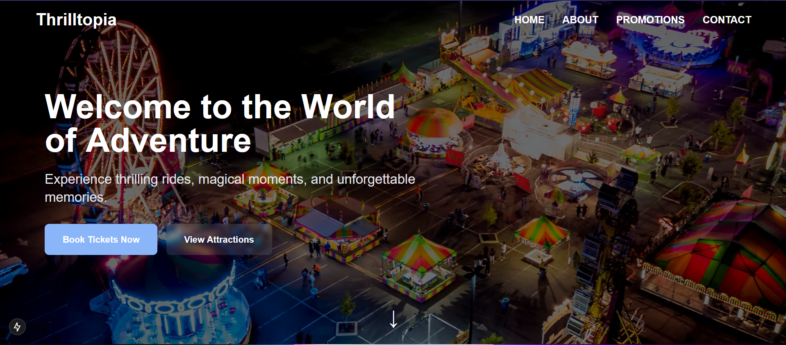

# 🎢 Thrilltopia Theme Park

A modern, interactive theme park website built with Next.js, featuring smooth animations and a responsive design.

## ✨ Features

- 🎨 Modern, responsive design with dark mode support
- 🌊 Smooth animations powered by Framer Motion
- 🎠 Interactive carousel for promotions and offers
- 📱 Mobile-friendly navigation
- 📝 Contact form with validation
- 🚀 Built with performance in mind

## 🛠️ Tech Stack

- [Next.js 15](https://nextjs.org/)
- [TypeScript](https://www.typescriptlang.org/)
- [Tailwind CSS](https://tailwindcss.com/)
- [Framer Motion](https://www.framer.com/motion/)
- [React Hook Form](https://react-hook-form.com/)
- [Swiper](https://swiperjs.com/)

## 🚀 Getting Started

1. Clone the repository:

git clone https://github.com/yourusername/thrilltopia.git

2. Install dependencies:
bash
npm install
or
yarn install

3. Run the development server:
npm run dev
or
yarn dev
4. Open [http://localhost:3000](http://localhost:3000) in your browser.

## 📁 Project Structure
src/
├── app/
│ ├── components/
│ │ └── sections/
│ ├── api/
│ └── page.tsx
├── hooks/
├── lib/
└── types/

## 🎨 Color Scheme

The project uses a custom color palette defined in the Tailwind configuration:

- Primary: Blue theme (#8AB6F9)
- Secondary: Dark blue (#00246B)
- Accent: Orange (#FF7A59)

## 📱 Responsive Design

The website is fully responsive with breakpoints at:
- Mobile: < 640px
- Tablet: 640px - 1024px
- Desktop: > 1024px

## 🤝 Contributing

Contributions are welcome! Please feel free to submit a Pull Request.

## 📄 License

This project is licensed under the MIT License - see the [LICENSE](LICENSE) file for details.

---

Made with ❤️ by [Bash John]